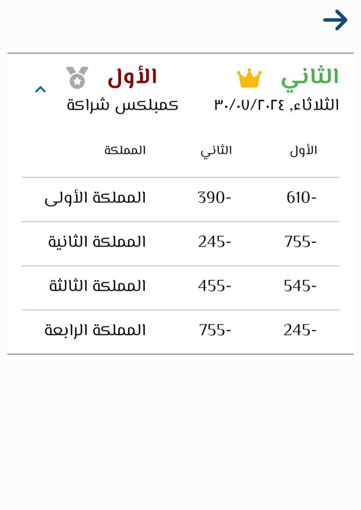

# Flutter Music App with BLoC

A Flutter application designed to calculate scores for the game Trix, featuring both Trix and Trix Complex modes. The app offers a simple, beautiful, and clear design, ensuring an enjoyable user experience for tracking and calculating game results.

## Screenshots

  
  
  
  
  
  
  

**Calculate your game scores with this beautiful and intuitive Flutter app!**

**Features:**

* **Effortless score calculation:** Quickly and easily calculate scores for both Trix and Trix Complex games.
* **Beautiful design:** Experience a sleek and intuitive user interface that enhances usability.
* **Game history archive:** Save and archive your game results for future reference.
* **Clear result display:** View your game scores in an organized and easy-to-read format.
* **Responsive experience:** BLoC ensures a smooth and reactive app performance.
* **User-friendly navigation:** Navigate through the app effortlessly with a well-structured layout.
* **Lightweight and fast:** Enjoy a fast and efficient app that doesn’t compromise on performance.

**Key Technologies:**

* **Flutter:** Cross-platform development for flexibility.
* **BLoC:** State management for a responsive experience.
* **Clean Architecture:** Ensures a well-structured and maintainable codebase.
* **Hive:** Lightweight and fast local data storage solution.

**Get Started:**

1. **Clone the repository:** `git clone https://github.com/Hamad-Anwar/Flutter-Music-Player-App-With-BLoc.git`
2. **Install dependencies:** `flutter pub get`
3. **Connect your device or start an emulator.**
4. **Run the app:** `flutter run`

### Dependencies

This project uses the following dependencies:

* flutter_localization: For internationalization and localization.
* equatable: Simplifies object comparison for BLoC.
* flutter_bloc: BLoC integration with Flutter widgets.
* intl: For date, number formatting, and localization.
* get_it: Simple service locator for dependency injection.
* hive: Lightweight and fast local data storage solution.
* hive_flutter: Hive integration with Flutter.
* cached_network_image: Efficient image caching for network images.
* flutter_screenutil: Responsive design for different screen sizes.
* device_preview: Helps with previewing your app on different devices.
* font_awesome_flutter: Icon pack based on Font Awesome.
* fluttertoast: Displays toast messages.
* toggle_switch: Customizable toggle switch widget.
* smooth_page_indicator: Create smooth page indicators for PageView.
* animated_splash_screen: Beautiful animated splash screens.
* package_info_plus: Retrieve information about the application package.

**Contribute & Connect:**

* **Report bugs or share ideas:** Submit pull requests or open issues.
* **Join the community:** Get updates and engage with other developers.

* **Star the project on GitHub if you like it!**
* **Share with your friends and Trix lovers.**

### Designed and developed with by [Anas Almadmouj](https://www.linkedin.com/in/anas-al-madmouj-0979271aa/).
